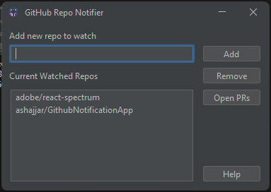
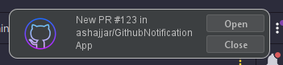

# Github Desktop Notifications

## Installation

You need to add an environment variable `GITHUB_TOKEN` for the application to work, the token has to be valid of course
for the app to work, and has to have access to the repos in the watch list.

## Extra Step on Mac
You need to do this after you define your `GITHUB_TOKEN` :
```shell
launchctl setenv GITHUB_TOKEN $GITHUB_TOKEN
```
## Usage

You add the repos you would like to watch:



You get notifications whenever there is a new PR in one of the watched repos



If you happen to miss some notification, or you want to see the currently open PRs, hit <kbd>Ctrl</kbd> + <kbd>O</kbd> or click `Open PRs` button, to see the list:


### Keymap

| Key                                                                    | Action                                        |
|------------------------------------------------------------------------|-----------------------------------------------|
| <kbd>Ctrl</kbd> + <kbd>ENTER</kbd> <br/> <kbd>ALT</kbd> + <kbd>A</kbd> | Insert new watched repo in the watch list     |
| <kbd>Ctrl</kbd> + <kbd>O</kbd> <br/> <kbd>ALT</kbd> + <kbd>O</kbd>     | Open a list of currently open PRs             |
| <kbd>Ctrl</kbd> + <kbd>D</kbd> <br/> <kbd>ALT</kbd> + <kbd>R</kbd>     | Removes the selected repo from the watch list |
| <kbd>Ctrl</kbd> + <kbd>S</kbd>                                         | Saves the repos watch list to disk            |
| <kbd>F1</kbd>  <br/> <kbd>ALT</kbd> + <kbd>H</kbd>                     | Show help message                             |
| <kbd>ALT</kbd> + <kbd>N</kbd>                                          | Focus the repo name text box                  |
| <kbd>ALT</kbd> + <kbd>W</kbd>                                          | Focus the repos list                          |

## On The Project and The Idea

This project was supposed to be a small script that reads the list of repos of a certain organisation on Github, which turned out to be not that trivial after all. So I decided to let Chat GPT write "all" the code in Kotlin, but it was absolute disaster 😅, so I asked it to write it in Java Swing and after so much tweaking of the prompts I got the [(initial commit)](https://github.com/ashajjar/GithubNotificationApp/commit/eebdde50b5a18cf3686fef818aa630560814d398). 

### Obstacles

The first problem was that the organisations API on Github is not that straight forward, main issue being the lack of filtering of repos, for example n Organisation like Adobe has on Github about 900 Repos, with no way to get specific repos, it would be impossible to read the PRs of all of them. Hence the idea turned to be based on `watching` instead of `pulling all`.

The second (unsolved issue) is the licensing, to publish software on the internet, you need to have code signing certificate which costs lots of money yearly, (even for open source software which is crazy). To solve this, I tried to switch platforms, to the web, but this turned out to be a difficult change, since the managing the notifications in the web needed some sort of shared state, which would be an expensive solution.

The third issue/requirement is to run the script across platforms. The native notifications API is very complicated and limites especially on MacOS. The web solution could have been a good fit for this problem however due to cost reasons mentioned above I turned back to Kotlin Compose, finally back to Swing again, but this time with a homemade notification center, where Native Notification API won't be necessary. 
